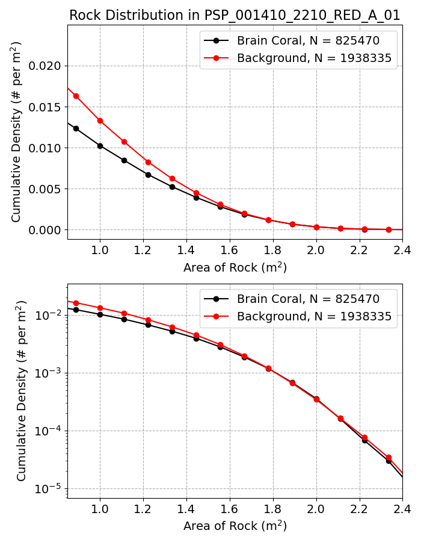
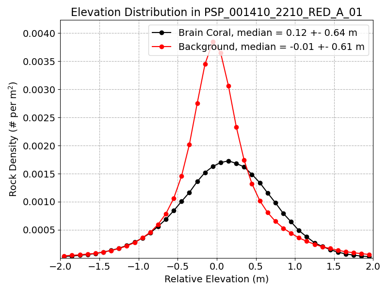

# HiRISE Rock Detector

An automated algorithm for measuring the frequency and size distribution of boulders on Mars using data from HiRISE/MRO. We developed an interactive application for making training data in a quick manner which is later used optimize a classification algorithm. 

## Installation

1. `conda create -n rock python=3.9`
2. `conda activate rock`
3. `conda install numpy scipy matplotlib pandas`
4. `conda install scikit-learn scikit-image opencv`
5. `pip install glymur tqdm rasterio`
6. `unzip training.zip`

## Evaluation

To find/segment rocks in your image use the script below

`python eval_rock.py -i images/PSP_001410_2210_RED_A_01_ORTHO.JP2`


Use the `--plot` flag on the `eval_rock.py` script to plot results while evaluating. The script can take up to 24 hours on some images and will save a mask of the predicted rock shadows that are used for the analysis below. No fine-tune or parameter tuning is necessary, the algorithm is trained on a variety of images and is robust to different lighting conditions and surface types. The algorithm is also parallelized and can take advantage of multiple cores on your machine.

```
usage: eval_rock.py [-h] [-i IMAGE] [-r RES] [-th THREADS] [-tr TRAIN] [-te TEST] [-o OUTDIR] [-p]

optional arguments:
  -h, --help            show this help message and exit
  -i IMAGE, --image IMAGE
                        Choose a JPEG2000 image to decode
  -r RES, --res RES     Resolution level to decode (0 is highest resolution)
  -th THREADS, --threads THREADS
                        number of threads for reading in JP2000 image
  -tr TRAIN, --train TRAIN
                        training data for rocks
  -te TEST, --test TEST
                        testing data for rocks
  -o OUTDIR, --outdir OUTDIR
                        Directory to save output images
  -p, --plot            plot results
```

## Density estimate

After evaluating an image the output mask can be used to estimate a rock size distribution. The `mask2density.py` script takes a mask of the rock shadows and calculates the rock size distribution. If you provide the script with a mask it can separate the rock size distribution into different regions of the image.



The data shown above is the same however the bottom plotis in a log scale and shows how the two regions converge at the largest rock sizes. 

```
usage: mask2density.py [-h] [-i IMAGE] [-o OUTDIR] [-th THREADS]

optional arguments:
  -h, --help            show this help message and exit
  -i IMAGE, --image IMAGE
                        Choose a JPEG2000 image to decode
  -o OUTDIR, --outdir OUTDIR
                        Directory to save outputs
  -th THREADS, --threads THREADS
                        number of threads for reading in JP2000 image
```

## DEM Analysis

The rock shadow segments are used to calculate the rock size distribution using a formalism similar to https://agupubs.onlinelibrary.wiley.com/doi/epdf/10.1029/2007JE003065 and https://agupubs.onlinelibrary.wiley.com/doi/epdf/10.1029/2021EA001959 . The `mask2dem.py` script takes a mask of the rock shadows and calculates the rock size distribution. If the corresponding DEM is provided, the script will also correlate the positions to elevation. 

```
python mask2dem.py 
--mask images/PSP_001410_2210_RED_A_01_ORTHO/mask.png 
--dem images/DTEEC_002175_2210_001410_2210_A01.IMG
```

We're interested in measure the rock density inside of a terrain called Brain Coral which has similarity to terrain on Earth called a sorted stone circle. The masks are generated from: https://github.com/pearsonkyle/Mars-Brain-Coral-Network and look like this:


The low resolution corresponds to the classifier algorithm however full-resolution masks are also available. 




## Make new training data

The `label_maker.py` script is used to create/add training data. It takes a JPEG2000 image as input and then you can use the mouse to label regions of the image as either rocks or not rocks. The script will then save the image patches in a directory called `patches` in the current directory. The patches are saved as 11x11 images. The script will organize them based on the source images and class label. The class directory will contain the training samples along with pickle files storing the positions and image data, separately. This is useful for later when you want to train different models using the curated samples.


`python label_maker.py -i images/PSP_001410_2210_RED_A_01_ORTHO.JP2`

### Keyboard Commands:
  - `n`: next tile in big image
  - `d` : delete last sample
  - `c`: change class
  - `t`: train model
  - `p`: predict rocks in image
  - `i`: clear patches
  - `left click`: create training sample


The label making script is set up to distinguish things that are and are not rocks. You can switch between the two classes by pressing the “c” button. Then a label will appear in the bottom right plot based on which class you are currently labelling. Rocks are green and the background is orange. After making a few hundred labels in each class, you can train a classifier by pressing the “t” button and then look at the terminal to see its accuracy. Afterwards, if you want to visualize some predictions, press the “p” button. A bunch of red squares should pop up. In some cases rocks are only visible in the bottom right plot when you mouse over the region but not the main image due to how it is scaled. The rock algorithm sees something similar to the bottom right plot. The classifier is a random forest algorithm from scikit learn.

```
usage: label_maker.py [-h] [-ws WINDOW] [-os OUTSIZE] [-o OUTDIR] [-n NAME] [-i IMAGE] [-r RES] [-t THREADS] [-re]

optional arguments:
  -h, --help            show this help message and exit
  -ws WINDOW, --window WINDOW
                        size of window to search
  -os OUTSIZE, --outsize OUTSIZE
                        size of output window
  -o OUTDIR, --outdir OUTDIR
                        Directory to save output images
  -n NAME, --name NAME  Name of output images
  -i IMAGE, --image IMAGE
                        Choose a JPEG2000 image to decode
  -r RES, --res RES     Resolution level to decode (0 is highest resolution)
  -t THREADS, --threads THREADS
                        number of threads for background class
  -re, --reset          delete existing labels4
```

After some images are labelled we can export the samples to a CSV file and later compile it into a single file which we can easily share and use for training. To create a CSV file run the `make_csv.py` script. The script will create a CSV file in the current directory with the name `samples.csv`. The CSV file will contain the image path, class label, and position of the sample. The script will also create a directory called `patches` which will contain the training samples. The patches are saved as 11x11 images. The script will organize them based on the source images and class label. The class directory will contain the training samples along with pickle files storing the positions and image data, separately. This is useful for later when you want to train different models using the curated samples.

`python make_csv.py -i images/PSP_001410_2210_RED_A_01_ORTHO.JP2 -ws 11`

Make sure to run this script on each image you labelled. Afterwards, combine all of the available CSV files into a single one for training.

`python combine_csv.py`


## Image labels

To download the data used in our study, navigate to the `images/` folder and run the download script or download the data manually from the HiRISE website:

https://www.uahirise.org/PDS/DTM/ESP/ORB_037200_037299/ESP_037262_1845_ESP_036761_1845/ESP_037262_1845_RED_A_01_ORTHO.JP2
https://www.uahirise.org/PDS/DTM/ESP/ORB_037200_037299/ESP_037262_1845_ESP_036761_1845/DTEEC_037262_1845_036761_1845_U01.IMG
https://www.uahirise.org/PDS/DTM/PSP/ORB_002100_002199/PSP_002175_2210_PSP_001410_2210/PSP_001410_2210_RED_A_01_ORTHO.JP2
https://www.uahirise.org/PDS/DTM/PSP/ORB_002100_002199/PSP_002175_2210_PSP_001410_2210/DTEEC_002175_2210_001410_2210_A01.IMG

https://hirise.lpl.arizona.edu/dtm/ESP_037262_1845
https://hirise.lpl.arizona.edu/dtm/PSP_001410_2210


## Training


After collecting a bunch of training samples we train an ensemble of 10 random forests using 4598 images (11x11) and evaluated on 302 images (102 rock, 200 background). The ROC plot can be reproduced running `trainer.py`.


## Reproducing Results
1. `conda create -n rock python=3.9`
2. `conda activate rock`
3. `conda install numpy scipy matplotlib pandas`
4. `conda install scikit-learn scikit-image opencv`
5. `pip install glymur tqdm`
6. `cd images`
7. `chmod +x batch_download.sh`
8. `./batch_download.sh`
9. `cd ..`
10. `python label_maker.py -i images/PSP_001410_2210_RED_A_01_ORTHO.JP2`
11. `python make_csv.py -i images/PSP_001410_2210_RED_A_01_ORTHO.JP2 -ws 11`
12. `python label_maker.py -i images/ESP_037262_1845_RED_A_01_ORTHO.JP2`
13. `python make_csv.py -i images/ESP_037262_1845_RED_A_01_ORTHO.JP2 -ws 11`
14. `python combine_csv.py -ws 11`
15. `python trainer.py -ws 11`
16. `python eval.py -i images/PSP_001410_2210_RED_A_01_ORTHO.JP2`
17. `python eval.py -i images/ESP_037262_1845_RED_A_01_ORTHO.JP2`
18. `python mask2density.py -i images/PSP_001410_2210_RED_A_01_ORTHO.JP2`
19. `python mask2density.py -i images/ESP_037262_1845_RED_A_01_ORTHO.JP2`


## re-training on different window sizes
1. `python make_csv.py -i images/PSP_001410_2210_RED_A_01_ORTHO.JP2 -ws 19`
2. `python make_csv.py -i images/ESP_037262_1845_RED_A_01_ORTHO.JP2 -ws 19`
3. `python combine_csv.py -ws 19`
4. `python trainer.py -ws 19`


# TO DO:
What should we upload to PDS?
- Brain Coral Maps/Mask
- Cleaned up rock mask (PNG) (add as output to mask2density.py)
- Send Density Plots to Eldar and folks + Rerun with bigger window size
- Compare density/size estimates in/out of Brain Coral section
- Size histogram in and out of brain coral area
- Relative elevation histogram in and out of brain coral 
- Histogram for insight landing site


# License

Copyright 2023, by the California Institute of Technology. ALL RIGHTS RESERVED. United States Government Sponsorship acknowledged. Any commercial use must be negotiated with the Office of Technology Transfer at the California Institute of Technology.
 
This software may be subject to U.S. export control laws. By accepting this software, the user agrees to comply with all applicable U.S. export laws and regulations. User has the responsibility to obtain export licenses, or other export authority as may be required before exporting such information to foreign countries or providing access to foreign persons.


# Acknowledgments

The research described in this publication was carried out in part at the Jet Propulsion Laboratory, California Institute of Technology, under a contract with the National Aeronautics and Space Administration. This research has made use of the High Resolution Imaging Science Experiment on the Mars Reconnaissance Orbiter, under contract with the National Aeronautics and Space Administration. We acknowledge funding support from the National Aeronautics and Space Administration (NASA) Mars Data Analysis Program (MDAP) Grant Number NNH19ZDA001N.


# Questions?
Does the abundance match the golumbeck images?
add stdev to relative elevation distribution
What would happen if you subtract a local slope?
What is the overall slope distribution?